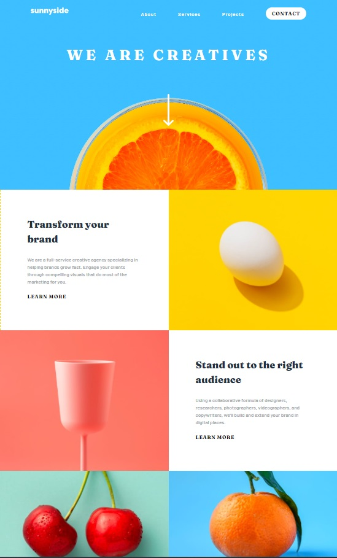

# Frontend Mentor - Sunnyside agency landing page solution

This is a solution to the [Sunnyside agency landing page challenge on Frontend Mentor](https://www.frontendmentor.io/challenges/sunnyside-agency-landing-page-7yVs3B6ef). Frontend Mentor challenges help you improve your coding skills by building realistic projects.

## Table of contents

- [Overview](#overview)
  - [The challenge](#the-challenge)
  - [Screenshot](#screenshot)
- [My process](#my-process)
  - [Built with](#built-with)
  - [What I learned](#what-i-learned)
  - [Continued development](#continued-development)
- [Author](#author)

## Overview

### The challenge

Users should be able to:

- View the optimal layout for the site depending on their device's screen size
- See hover states for all interactive elements on the page

### Screenshot

### Links

- Solution URL: [Add solution URL here](https://your-solution-url.com)
- Live Site URL: [Add live site URL here](https://your-live-site-url.com)

## My process

### Built with

- Semantic HTML5 markup
- CSS custom properties
- Flexbox
- CSS Grid
- Mobile-first workflow

### What I learned

I realy enjoyed building this page. There are a couple of small challenges hidden in the design that needed a creative solution. These were the colored underlines of the links, the triangle shape on the mobile menu and the colorchange on the bottom SVG's on hover. The biggest challenge was the mobile menu.

### Continued development

The mobile menu needs to be practiced more, but for now I'm happy with the result. 

## Author

- Website - [Rik van der Sar](https://github.com/RikvanderSar)
- Frontend Mentor - [@RikvanderSar](https://www.frontendmentor.io/profile/RikvanderSar)
